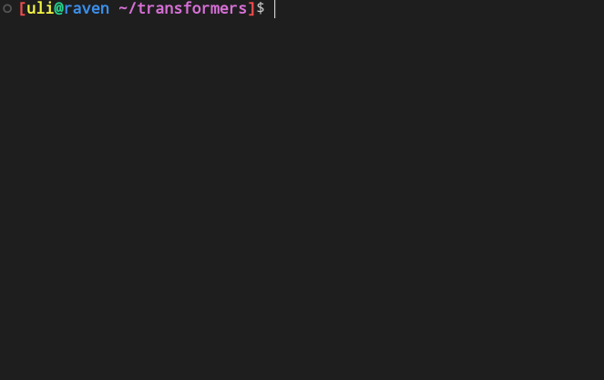
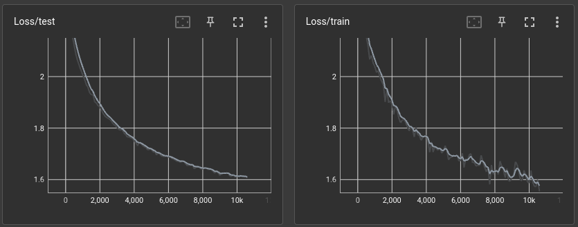
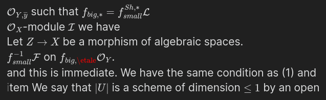

# Transformers



Hand-written transformers for learning purposes. Written after reading Karpathy's wonderful [makemore](https://github.com/karpathy/makemore) project. Most of the code is written from memory, with occasional reading of makemore's code when stuck.


## Experiments

### Stacks project

Training on the [stacks project](https://github.com/stacks/stacks-project) (~730k LOC) with ~2M param model (4 layers, 4 heads, 64 dim embeddings.)

```sh
python main.py --input-file='data/stacks.tex' --tokenizer='latex' --batch-size=96
```

The model is small, but according to [Chinchilla](https://arxiv.org/pdf/2203.15556.pdf) you want ~10-20x more tokens then parameters, which I don't have. (Extrapolating Chinchilla to tiny models is sketchy, but better then nothing. might test this later.)

Results from 20 minutes of training on my GTX 1070:



The trained model can hallucinate some fun stuff. Here's some generated output (each line is an independent generation)

```tex
$\mathcal{O}_{Y, \overline{y}}$ such that $f_{big, *} = f_{small}^{Sh, *}\mathcal{L}$
$\mathcal{O}_X$-module $\mathcal{I}$ we have
Let $Z \to X$ be a morphism of algebraic spaces.
$f_{small}^{-1}\mathcal{F}$ on $f_{big, \etale}\mathcal{O}_Y$.
and this is immediate. We have the same condition as (1) and
\item We say that $|U|$ is a scheme of dimension $\leq 1$ by an open
```

Most of the tex math compiles!



I'm gonna add context soon, and see if the model can write a full paper.